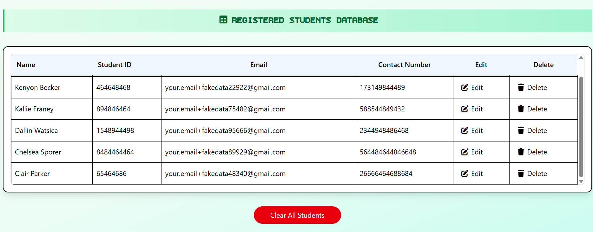

# Student Registration System

A web application for registering, editing, and deleting student records. Built with semantic HTML, custom CSS, and vanilla JavaScript, the system persists data using localStorage—even after the page is refreshed.

---

## 🚀 Features

- **Register new students** with Name, Student ID, Email, and Contact Number
- **Edit and delete student records** directly in the UI
- **Clear all student records**
- **Persistent storage** via browser localStorage
- **Input validation:**
  - Student Name: Only characters
  - Student ID & Contact No.: Only numbers
  - Email: Valid email format
  - No empty or duplicate entries
- **Responsive design** for all devices
- **Dynamic vertical scrollbar** appears when the list grows
- **Accessible and semantic HTML structure**
- **Well-commented, organized code**

---

## 📸 Demo

 

---

## 🛠️ Tech Stack

- **HTML5** (semantic tags)
- **CSS3** (custom styling)
- **JavaScript (Vanilla)**
- **localStorage** (for persistence)

---

## 🧑‍💻 Usage

1. **Clone the repository**

    ```bash
    git clone https://github.com/steller520/Dom_manipulation.git
    cd Dom_manipulation
    ```

2. **Open `index.html` in your browser**

    - No build tools or server required
    - All dependencies are included

---

## 🎨 UI Highlights

- Clean, modern layout
- Form and table sections are visually separated for clarity
- Table shows all student details, with Edit/Delete actions
- Scrollbar appears if the list exceeds a set height
- Table header remains visible during scroll

---

## 📂 File Structure

```
Dom_manipulation/
├── src/
│   ├── css/
│   │   └── style.css
│   ├── images/
|   |   ├──image1.png  
|   |   └──favicons/
│   │        └── favicon.ico
│   └── js/
│       └── script.js
├── index.html
└── README.md

```

---

## 📝 Assignment Checklist

- [x] Basic HTML structure with meta tags and meaningful titles
- [x] Catchy header and system description
- [x] Form with all required input fields and validation
- [x] Organized display section for student records
- [x] Custom CSS styling for visual appeal
- [x] JavaScript for add/edit/delete, validation, persistence, scrollbar
- [x] Well-documented code with comments
- [x] Semantic HTML for accessibility
- [x] Uploaded to GitHub

---

## 📃 License

This project is licensed under the Internshala License.

---

## 🤝 Contributing

Pull requests and suggestions are welcome! Please open an issue or submit a PR.

---

## 👤 Author

Made by [steller520](https://github.com/steller520)
